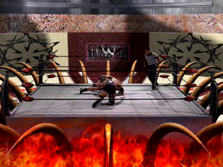

# WCW CyberRing PAV Decryptor

[](https://www.python.org/downloads/)
[](LICENSE)
[]()
[]()
[]()
[]()
[]()

**Reverse engineered 1999 ULI Player encryption to recover lost WCW wrestling content after 25 years.**


*Frame from TVKCYBER.mpg - a WCW match filmed against blue screen with CGI "CyberRing" arena composited in. This content has been inaccessible since ~2000.*

---

The WCW Internet Powerdisk ("CyberRing" / "Slam Society") was a promotional CD-ROM bundled
with WCW Magazine in 1999. It contained 61 wrestling video clips encrypted with a proprietary
format that required an online server for decryption keys. When UIT's servers went offline
around 2000, the content became permanently inaccessible. This project recovers all 61 videos
through cryptanalysis of the encryption scheme.

## Quick Start

```bash
# Extract the ISO (requires 7-Zip)
7z x WCW_R1.ISO -oiso_contents

# Decrypt all PAV files to MPEG-1
python decrypt_pav.py

# Convert to MP4 (optional, requires ffmpeg)
python convert_mp4.py
```

## What's on the Disc

61 video clips (51 minutes 20 seconds total) of WCW wrestling content at 320x240, 30fps:

| Category | Files | Description |
|----------|-------|-------------|
| Match Highlights | FVWCYBER, PVHCYBER, TVKCYBER, GOLDHIGH, HHIGH, HVGHIGH, HVMHIGH, SVNHIGH, SVSHIGH | Full matches and highlight reels |
| Wrestler Bios | ARNBIO, BAMBIO, BUFFBIO, CATBIO, DDPBIO, DISCOBIO, FLAIRBIO, GOLDBIO, HOGANBIO, KNOBBIO, NASHBIO, STEINBIO, STINGBIO | Wrestler profile videos |
| Hacker Segments | HACKER1-HACKER8 | Storyline segments |
| Promos/Merch | ARNSHIRT, GOLDSHRT, HOGANMER, KNOBMER, STINGMER, NASHCHRT, NASHHAT, DDPHAT, STINGPRO | Merchandise and promo clips |
| Show Intros | INTRO, NITRO, NITRO2, THUNDER, SURGE | WCW show opening sequences |
| Other | KIDVID, NGIRLS, MADUSA, MYSTERIO, KONNAN, KNOB, KNOBS1, KNOBS2, OAKFW, OAKPH, OAKTK, RIGGS1, RIGGS2, SJHEEVE, SJPUNISH, SJVEGG, CAT | Misc segments |

## The Encryption Scheme

### Format: PAVENCRYPT

```
[10 bytes: "PAVENCRYPT" magic]
[~16-32 KB: Unencrypted MPEG-1 preview (2 frames, no audio)]
[Remainder: Encrypted MPEG-1 Program Stream]
```

### Cipher: Repeating-Key Subtraction

```
plaintext[i] = (ciphertext[i] - key[i % key_length]) mod 256
```

- Each file has a unique randomly-generated key (8-24 bytes, printable ASCII)
- Keys were served from a remote server at `SOFTWARE\UIT\UliPlayer\Servers`
- Server has been offline since ~2000
- No key material exists on the disc itself

### Key Recovery: Known-Plaintext Attack

The encryption is broken by exploiting the known structure of MPEG-1 Program Streams:

1. MPEG-1 PS files end with 0xFF padding bytes before the Program End Code (00 00 01 B9)
2. Encrypted 0xFF bytes with a repeating key produce a repeating ciphertext pattern
3. The key period is detected via autocorrelation of the file tail
4. Key bytes are derived: `key[i] = (ciphertext[i] - 0xFF) mod 256`
5. Verification: decrypting the first encrypted bytes must produce a valid MPEG-1 Pack Header

This attack works on all 61 files without any external key material.

## Technical Details

See [FINDINGS.md](FINDINGS.md) for the full technical writeup including:
- Complete PAV file format specification
- Annotated disassembly of the decryption routine from PavSource.ax
- All 61 recovered keys
- DirectShow filter graph architecture

See [TIMELINE.md](TIMELINE.md) for the step-by-step reverse engineering process.

## Files

```
decrypt_pav.py      - Main decryptor (PAV → MPEG-1 PS)
convert_mp4.py      - Batch converter (MPEG-1 → H.264 MP4)
analyze_pav.py      - Analysis tool for examining PAV file structure
FINDINGS.md         - Complete technical findings
TIMELINE.md         - RE process documentation
```

## Requirements

- Python 3.6+
- ffmpeg (for MP4 conversion only)
- 7-Zip or similar (for ISO extraction only)

## Output Format

Decrypted files are standard MPEG-1 Program Stream:

| Property | Value |
|----------|-------|
| Video | MPEG-1, 320x240, 30fps, ~1.29 Mbps |
| Audio | MPEG Layer 2, 44100 Hz, Mono, 64 kbps |

These play in VLC, ffplay, or any modern media player without additional codecs.

## Applicability to Other PAV Files

This tool should work on any PAVENCRYPT-format file, not just this disc. The ULI Player
was used by multiple content providers in the late 1990s. If you have other `.PAV` files
from that era, this decryptor may recover them.

## Context

This is a digital preservation project. The WCW Internet Powerdisk represents a class of
late-1990s multimedia content that became inaccessible when DRM servers shut down. The
encryption was never "cracked" during the product's lifetime because the player simply
handled it transparently. When the infrastructure disappeared, so did access to the content.

The methodology demonstrated here (known-plaintext cryptanalysis of weak stream ciphers
over known file formats) is applicable to other dead DRM schemes from the same era.
